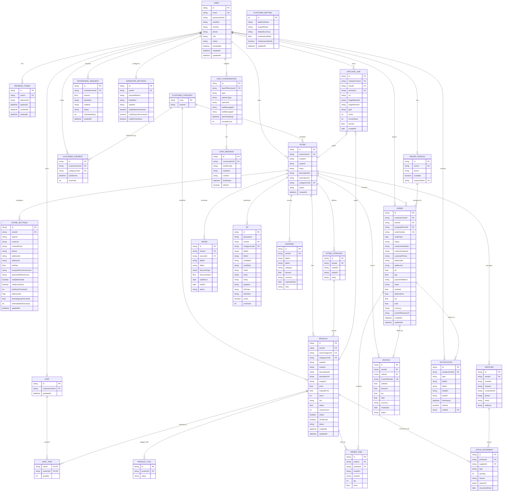

# BabRizq Backend — Analysis Document (Phase 1)

> Derived from the six role apps (`apps/*-app`), their `docs/needed-endpoints-from-backend/*`
> API contracts, and the legacy `needed-endpoints-for-backend/MeramiedErd.md`.

## 1. Domain model discovery

### 1.1 The six roles & their domains

| Role app | Folder | Primary domain(s) |
|---|---|---|
| Customer (storefront) | `apps/customer-app` | Catalog (products/stores/categories), cart, checkout, ads, recommendations |
| Store Owner | `apps/store-owner-app` | Products, categories, orders, offers, chat, warehouse, accounting, settings, sales/reports |
| Back Office (ops) | `apps/back-office-app` | Orders across all stores, drivers, live map, notifications, support chat, stock checks |
| Delivery Driver | `apps/delivery-app` | Assigned orders, order lifecycle (pickup → delivered), proof of delivery, history, profile |
| Marketer (affiliate) | `apps/marketer-app` | Affiliate links, targets, performance, settings |
| Admin | `apps/admin-app` | Platform users (RBAC), platform settings, platform KPIs, admin account |

### 1.2 Data flows

- **Commerce flow**: customer browses catalog → cart → checkout creates `Order` (per store) →
  store-owner sees it → back-office assigns `Driver` → driver updates status until `delivered`
  (proof-of-delivery attached) → store-owner accounting (invoice/expense) and marketer
  commissions (affiliate conversions) are derived.
- **Cross-cutting flow**: every status change / new order / chat message produces a
  `Notification` for the relevant role user (realtime via WebSocket).
- **Admin flow**: platform KPIs are **derived** (counts/sums over persisted entities), never stored.

### 1.3 Auth/authorization pattern

- JWT bearer; payload claims mirror the mock JWT the frontend already produces
  (`nameidentifier` = user id, `role`, `name`, `email` — see `apps/customer-app/src/features/auth/model/authContext.tsx`).
- **RBAC**: exactly six roles — `customer`, `store_owner`, `back_office`, `delivery`, `marketer`, `admin`.
- Endpoint docs declare the required role per endpoint (`_shared.md` of each app).
- Admin can suspend users (`status: active | suspended`).

## 2. Entity-relationship diagram

Ported to a relational model (SQLite/Postgres-ready). `PlatformStats`, dashboard metrics and
sales/report series are **derived views**, not tables.

## 3. Entity specifications (key invariants)

| Entity | Key attributes | Invariants / validation |
|---|---|---|
| `User` | email, passwordHash, nameEn/Ar, phone, role, status | email unique; role ∈ 6 roles; status ∈ active/suspended; password ≥ 8 chars (bcrypt) |
| `Store` | ownerId, nameEn/Ar, emoji, categoryCode | owner is `store_owner`; categoryCode ∈ PlatformCategory |
| `Product` | storeId, storeCategoryId, categoryCode, price, stock, sku | price ≥ 0; stock ≥ 0; sku unique per store |
| `Order` | orderNumber, status, totals, assignedDriverId | status flow: `pending → processing → assigned → picked_up → in_transit → delivered`; `total = subtotal + deliveryFee + tax`; assignedDriver is `delivery` role |
| `OrderItem` | orderId, productId, qty, price | qty > 0; price snapshot at purchase time (product price may change later) |
| `Invoice` | storeId, orderId, subtotal, discount, tax, total | `total = subtotal − discount + tax` (covered by a frontend unit test already) |
| `AffiliateLink` | marketerUserId, url, type, clicks, conversions, earned | target is either a store or a product (exactly one FK set); clicks/conversions/earned ≥ 0 |
| `ChatConversation` | partnerType, partnerId | partner is customer or store; messages appended with last-message cache |
| `Notification` | recipientUserId, type, isRead | one per recipient per event; realtime delivery via WebSocket |

**Derived (never stored)**: platform KPIs (total users/stores/revenue, active marketers), dashboard
metrics per role, sales/report series, order history aggregates, affiliate performance totals.

## 4. Relationships matrix

| From | To | Cardinality | FK |
|---|---|---|---|
| User (store_owner) | Store | 1 → many | `Store.ownerUserId` |
| User (delivery) | DriverProfile | 1 → 1 | `DriverProfile.userId` |
| User (customer) | Cart | 1 → 1 | `Cart.customerUserId` |
| Cart | CartItem | 1 → many | `CartItem.cartId` |
| Product | CartItem | 1 → many | `CartItem.productId` |
| Store | Product | 1 → many | `Product.storeId` |
| StoreCategory | Product | 1 → many | `Product.storeCategoryId` |
| PlatformCategory | Product / Store | 1 → many | `Product.categoryCode` / `Store.categoryCode` |
| User (customer) | Order | 1 → many | `Order.customerUserId` |
| Store | Order | 1 → many | `Order.storeId` |
| DriverProfile | Order | 1 → many | `Order.assignedDriverId` |
| Order | OrderItem | 1 → many | `OrderItem.orderId` |
| Order | Invoice | 1 → 1 | `Invoice.orderId` |
| Store | Invoice / Expense / Supplier / Offer / Ad | 1 → many | respective FKs |
| Product | StockMovement / ProductTag / Offer | 1 → many | respective FKs |
| User (marketer) | AffiliateLink / WithdrawalRequest / MarketerSettings | 1 → many / 1 → 1 | respective FKs |
| AffiliateLink | Store / Product (target) | many → 0..1 each | `AffiliateLink.storeId` / `.productId` (exactly one set) |
| User | Notification | 1 → many | `Notification.recipientUserId` |
| User (back_office) | ChatConversation | 1 → many | `ChatConversation.backOfficeUserId` |
| ChatConversation | ChatMessage | 1 → many | `ChatMessage.conversationId` |

## 5. API endpoint mapping (frontend screens → endpoints)

| Role app / screen | Endpoint (per `docs/needed-endpoints-from-backend`) | Entity |
|---|---|---|
| Customer — home | `GET /api/customer/home` (ads, featured, categories, recommendations) | Ad, Product, Category |
| Customer — catalog | `GET /api/customer/products?category=&store=&page=` · `GET /api/customer/stores` · `GET /api/customer/categories` | Product, Store, Category |
| Customer — product detail | `GET /api/customer/products/{id}` | Product |
| Customer — cart | `GET/POST/PUT/DELETE /api/customer/cart` | Cart, CartItem |
| Customer — checkout | `POST /api/customer/checkout` | Order, OrderItem |
| Customer — ads | `GET /api/customer/ads?placement=home|store|category` | Ad |
| Customer — recommendations | `GET /api/customer/recommendations` | CustomerInterest, Product |
| Store owner — products | `GET/POST/PUT/DELETE /api/store-owner/products` | Product, ProductTag |
| Store owner — categories | `GET/POST /api/store-owner/categories` | StoreCategory |
| Store owner — orders | `GET /api/store-owner/orders?status=` | Order |
| Store owner — offers | `GET/POST/PUT /api/store-owner/offers` | Offer |
| Store owner — chat | `GET/POST /api/store-owner/chat/...` | ChatConversation, ChatMessage |
| Store owner — warehouse | `GET/POST /api/store-owner/suppliers` · `POST /api/store-owner/stock-movements` | Supplier, StockMovement |
| Store owner — accounting | `GET/POST /api/store-owner/expenses` · `GET/POST /api/store-owner/invoices` | Expense, Invoice |
| Store owner — settings | `GET/PUT /api/store-owner/settings` | StoreSettings |
| Store owner — sales/reports | `GET /api/store-owner/sales` · `GET /api/store-owner/reports` | Order (derived) |
| Back office — orders | `GET /api/backoffice/orders?page=&search=&status=` · `GET /{id}` · `PUT /{id}/status` · `PUT /{id}/assign-driver` | Order, User(driver) |
| Back office — drivers | `GET /api/backoffice/drivers` | DriverProfile |
| Back office — map | `GET /api/backoffice/map/drivers` (live) | DriverProfile (WebSocket) |
| Back office — notifications | `GET /api/backoffice/notifications?page=&type=` · `PUT /read` | Notification |
| Back office — chat | `GET/POST /api/backoffice/chat/conversations/{id}/messages` | ChatConversation, ChatMessage |
| Back office — stock check | `GET /api/store-owner/products/{id}/stock` | Product |
| Delivery — orders | `GET /api/delivery/orders?status=` · `PUT /{id}/status` · `POST /{id}/proof-of-delivery` | Order |
| Delivery — history | `GET /api/delivery/history` | Order (derived) |
| Delivery — profile | `GET/PUT /api/delivery/me` | User, DriverProfile |
| Marketer — links | `GET/POST /api/marketer/links` · `GET /api/marketer/targets` | AffiliateLink, Store, Product |
| Marketer — performance | `GET /api/marketer/performance` | AffiliateLink (derived) |
| Marketer — settings | `GET/PUT /api/marketer/settings` | MarketerSettings |
| Admin — overview | `GET /api/admin/overview` | derived KPIs |
| Admin — users | `GET/POST /api/admin/users` · `PUT /{id}/role` · `PUT /{id}/status` | User |
| Admin — settings | `GET/PUT /api/admin/settings` | PlatformSetting |
| Admin — profile | `GET/PUT /api/admin/me` · `POST /api/admin/me/change-password` | User |
| All apps — auth | `POST /api/auth/login` · `POST /api/auth/refresh` · `POST /api/auth/register` · `GET /api/auth/me` · `POST /api/auth/logout` | User, RefreshToken |

## 6. Design decisions (ADR-lite)

- **Modular monolith, clean architecture** — six domain modules mirror the six role apps; each has
  `presentation / application / domain / infrastructure` layers; a shared kernel for cross-cutting concerns.
- **Relational + Prisma** — SQLite for dev, provider-swappable to Postgres/MySQL (no raw SQL; indexes
  declared in schema).
- **JWT access + rotating refresh tokens** — `RefreshToken` table enables revocation.
- **Realtime** — Notifications module publishes via a WebSocket gateway (JWT-authenticated handshake);
  REST remains the source of truth.
- **External services behind ports** — payments/email/pdf/qr/maps/storage/cache are defined as
  interfaces with local/mock implementations first (runs without keys); provider adapters land in the
  integration phase.
- **Response envelope** — the frontend expects the `{ isSuccess, isError, errors, topError, value }`
  shape from the endpoint docs; a global interceptor + exception filter implement it (documented in
  `docs/api-conventions.md`).

## 7. Backend roadmap

1. **Core** (this phase): scaffold, config, shared kernel, Prisma schema + seed, auth/RBAC, health, Swagger. ✅
2. **Domain modules**: auth → customer (catalog/cart/checkout/ads/recommendations) → store-owner →
   back-office → delivery → marketer → admin.
3. **Integrations**: payments (Stripe/PayPal), email (Nodemailer + queue), PDF, QR, maps, storage, Redis cache.
4. **Hardening**: rate limiting, e2e tests, Docker, monitoring.
