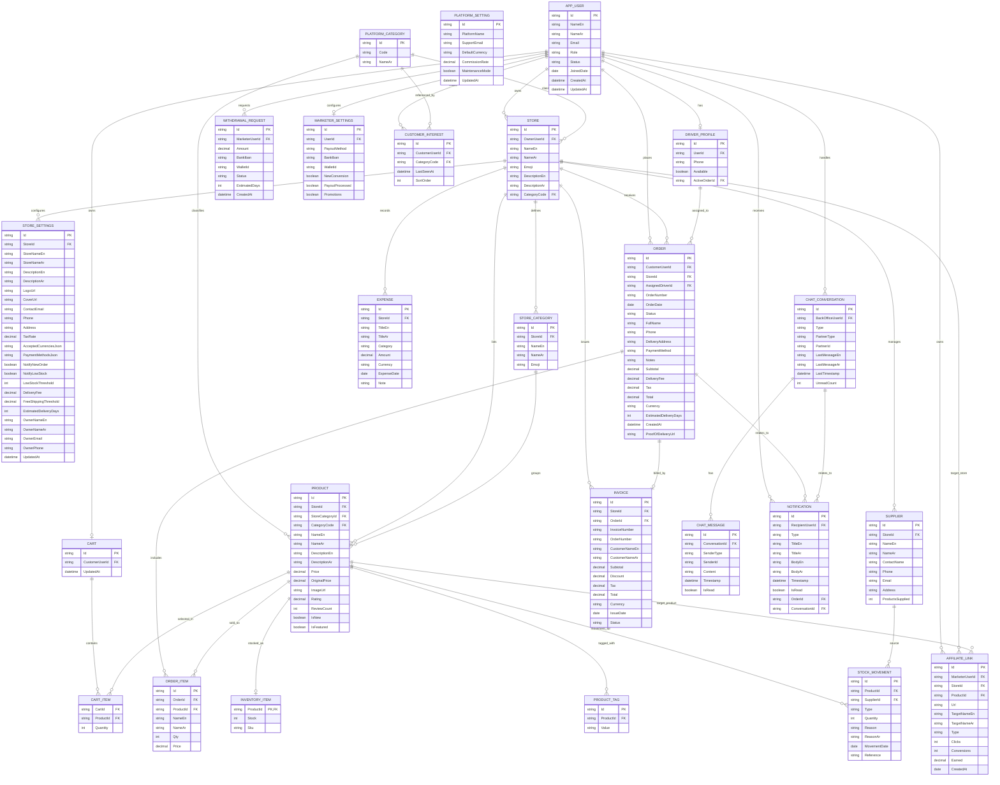

# Meramied ERD

## Source Analysis

This ERD was derived from the backend endpoint documentation in `needed-endpoints-for-backend/`.

### What the docs imply
- `customer/` defines the storefront commerce flow: catalog, cart, checkout, recommendations, and ads.
- `store-owner/` defines store-scoped entities: products, categories, orders, accounting, warehouse, and settings.
- `back-office/` defines cross-platform operations: orders, drivers, notifications, and chat.
- `delivery-driver/` defines driver-scoped order lifecycle and proof-of-delivery.
- `marketer/` defines affiliate links, performance analytics, withdrawals, and payout settings.
- `admin/` defines platform users, platform settings, and admin account management.

### EF Core modeling assumptions
- Dashboard metrics are derived from persisted entities, not stored as separate tables.
- Names are bilingual in most entities: `NameEn` and `NameAr`.
- Collection-like DTO fields such as tags or repeated settings can be modeled as owned collections or separate tables in EF Core.
- Some back-office shapes are polymorphic in the docs. In the diagram below, they are represented with explicit scalar foreign-key fields where possible.

## ERD Notes
- `PlatformSetting` is a singleton table.
- `StoreSettings` and `MarketerSettings` are one-to-one extensions of the owning user/store.
- `DriverProfile` is a one-to-one extension of the delivery user.
- `ChatConversation` supports customer/store partners via `PartnerType` and `PartnerId`.
- `AffiliateLink` can target either a store or a product; in EF Core this can be mapped with optional FKs plus a check constraint.

## Mermaid ER Diagram

## Suggested EF Core entities
- `AppUser`
- `PlatformSetting`
- `PlatformCategory`
- `Store`
- `StoreSettings`
- `StoreCategory`
- `Product`
- `ProductTag`
- `InventoryItem`
- `StockMovement`
- `Supplier`
- `Cart`
- `CartItem`
- `Order`
- `OrderItem`
- `Invoice`
- `Expense`
- `DriverProfile`
- `AffiliateLink`
- `WithdrawalRequest`
- `MarketerSettings`
- `CustomerInterest`
- `ChatConversation`
- `ChatMessage`
- `Notification`

## Implementation note for EF Core
If you want, the next step can be turning this ERD into:
- C# entity classes
- `DbContext` configuration
- Fluent API relationships and constraints
- migration-ready EF Core mapping
